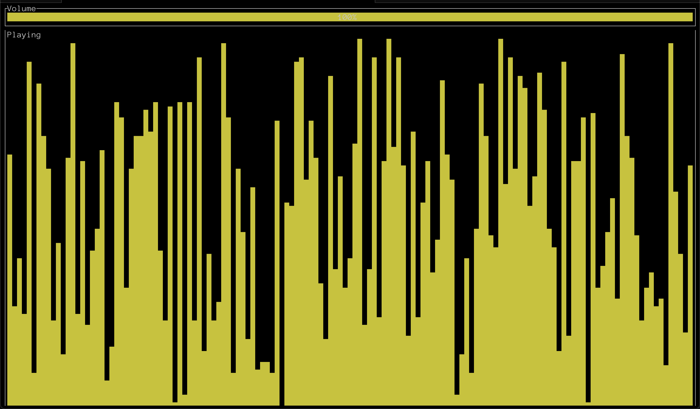

# rauschen

To work productively, you sometimes just need that special atmosphere, like being on a high-speed train. Install `rauschen` to get the atmosphere without having to book a train ticket.



## Installation

```
$ cargo install rauschen
```

Please note: You need internet access for the first startup, as `rauschen` downloads the audio file it plays and stores it locally. After that, no internet connection is required.

## Development

```
$ cargo run
```

## Credits

- `eurostar_car.ogg`: https://bigsoundbank.com/detail-0635-eurostar-car.html

## License

MIT